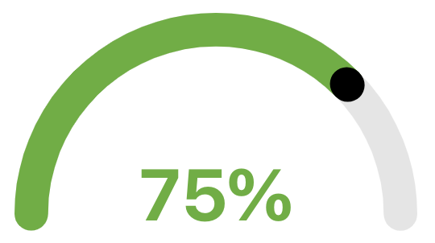

# DEPRECATED.!!!
We recommend using the react-gauges library [react-gauges](https://www.npmjs.com/package/react-gauges)


# react-simple-gauge

[](https://www.npmjs.com/package/react-simple-gauges) [](https://standardjs.com)



## Install

```bash
npm install --save react-simple-gauges
```

## Usage

```jsx
import React, { Component } from 'react'

import {SimpleGauge} from 'react-simple-gauges'

class Example extends Component {
  render() {
    return <SimpleGauge percent="75"/>
  }
}
```

## Options

| Option | type | Description | Example | 
|--|--|--|--|
| percent | required | Percent of progress in gauge | 75 |
| color | optional | Color if not define intervals of colors | #FFFFFF, red, rgba(255,243,12,.5) |
| intervals | optional | Intervals values for define color, value in [min,max> | [60,75,101] |
| colors | optional | Array of colors for intervals values | ['green','grba(255,255,40,.5)','#d73a49'] |
## License

MIT © [kevinjpuscan](https://github.com/kevinjpuscan)
